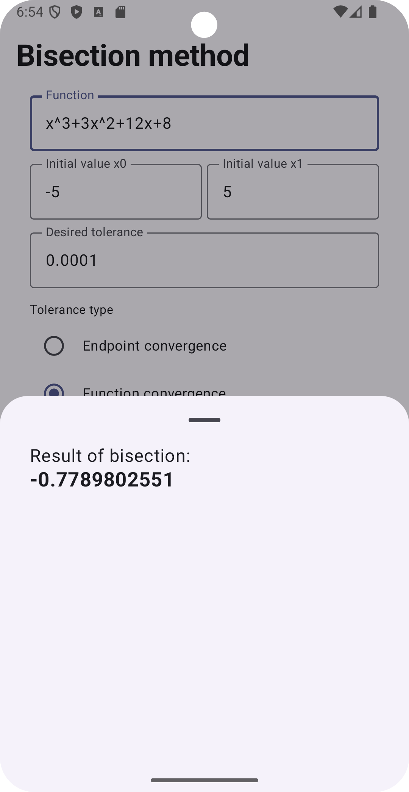

# Calculadora del Método de Bisección

Esta aplicación móvil fue desarrollada para un proyecto universitario para la meteria "**Programación móvil**". La aplicación implementa el método de bisección, un algoritmo numérico para encontrar raíces de funciones.

# Uso
Al iniciar la aplicación, el usuario verá una pantalla donde podrá ingresar los parámetros necesarios para el método de bisección:
1. **Función**: La función f(x) a la cual se aplicará el método.
2. **Intervalo**: Los valores de a y b para el intervalo en el que se buscará la raíz.
3. **Tolerancia**: Un valor que determina la precisión de la solución.
4. **Tipo de tolerancia**: Valor que determina el tipo de convergencia que se usuara para determinar la raíz
5. **Número de decimales**: Un valor que establece el número de decimales que se usará para la presentación del resultado

La calculadora ejecutará el algoritmo y devolverá la raíz aproximada de la función dentro del intervalo dado.

# Tecnologías usadas
* **Kotlin**: Lenguaje de programación.
* **Jetpack Compose**: Para la interfaz de usuario declarativa.
* **MVVM**: Patrón de diseño para separar la lógica de la interfaz de usuario.
* **ViewModel**: Para manejar los datos y el estado de la UI.

# Capturas de pantalla
<table>
  <tr>
    <td></td>
    <td></td>
  </tr>
  <tr>
    <td></td>
    <td></td>
  </tr>
</table>

# Licencia
Este proyecto está licenciado bajo la Licencia MIT.

# Contacto
Creado por whgarcia.dev@gmail.com
